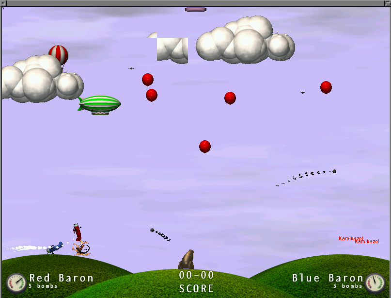

### Airstrike amiga
This is a port of a game I found on the Debian repository called airstrike.

The port is intended to run in an high end Amiga RTG system like a Vampire.

The game was compiled with bebbo's gcc compiler and some libsdl1.2 for amiga courtesy of EAB Amigadev group (THX Marlon).

To ease the build process I built a docker container so, to get the new executable just type:

```
docker run -v #PUTHEREAIRSTRIKE-AMIGAPATH#/:/data -w /data -t  --rm ozzyboshi/bebbo-amiga-gcc make
```

At the end of the process a new executable file called airstrike is created in the root directory.

Home page of the original game : http://icculus.org/airstrike/

Complete source and binary packages available on aminet:

http://aminet.net/package/game/misc/airstrike-amiga-1.6

http://aminet.net/package/game/misc/airstrike-amiga-src-1.6


